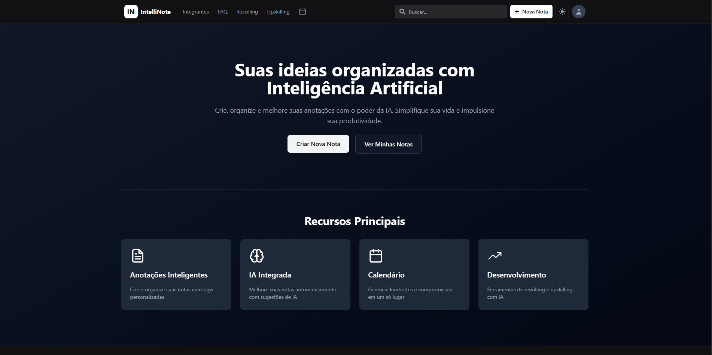
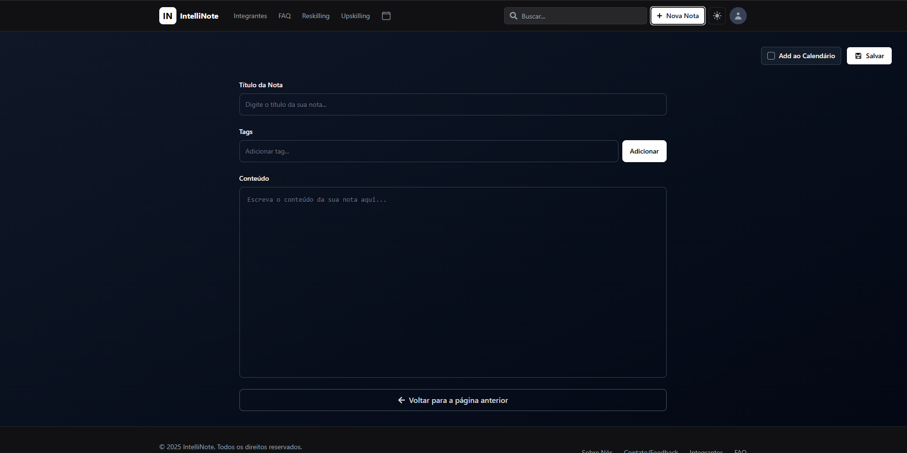

<h1 align="center">IntelliNote</h1>

###

<p align="left">
Uma plataforma unificada de produtividade e desenvolvimento profissional, desenhada para os desafios do futuro do trabalho. O IntelliNote combina a organização de um workspace flexível com o poder de uma IA generativa integrada, atuando como uma parceira para o dia a dia. A solução foca em ajudar profissionais a conciliar a vida pessoal e profissional em regimes híbridos e oferece uma plataforma inteligente de <i>upskilling</i> e <i>reskilling</i> baseada em IA  
</p>

###

<h1 align="center">📋Sumário📋</h1>

###

<p align="left">
  
  ```
  1. Título e Descrição
  3. Sumário
  2. Status do Projeto
  4. Sobre o Projeto
  5. Tecnologias Utilizadas
  6. Instalação
  7. Como Usar
  8. Estrutura de Pastas
  9. Endpoints ou Rotas Principais
  10. Autores e Créditos
  11. Screenshots / Demonstração
  12. Contato
  ```
</p>

###

<h1 align="center">✅Status do Projeto ✅</h1>

<div align="center">

</div>

<h1 align="center">❗Sobre o Projeto❗</h1>

###

<p align="left">
Este projeto é a nossa resposta à <strong>Global Solution 2025/2 da FIAP</strong>, que propõe o desafio de reimaginar "O Futuro do Trabalho". Vivemos um momento de disrupção, onde avanços como a inteligência artificial estão transformando profissões. Em vez de ver esse cenário como uma ameaça, nossa solução o encara como uma "oportunidade única de reimaginar o trabalho".
<br><br>
O IntelliNote nasce da fusão de três pilares de inspiração fornecidos pelo desafio:
</p>
<ul align="left">
  <li>Plataformas de upskilling e reskilling baseadas em IA;</li>
  <li>Aplicativos para conciliar vida pessoal e profissional em regimes híbridos;</li>
  <li>Bots e agentes de IA como parceiros no dia a dia de trabalho.</li>
</ul>
<p align="left">
Nossa solução é um assistente de produtividade que centraliza tarefas, notas e calendários, ajudando o profissional a organizar sua rotina híbrida. O diferencial é a nossa IA generativa integrada, que atua como uma parceira proativa: ela não apenas ajuda a executar tarefas, mas também analisa os objetivos de carreira do usuário para sugerir ativamente trilhas de <i>upskilling</i> e <i>reskilling</i>, conectando o trabalho diário ao desenvolvimento contínuo.
</p>

###

<h1 align="center">🌐Tecnologias Utilizadas🌐</h1>

###

<div align="center">
  
  
  
  
  
  
  
  
  
</div>

###

<h1 align="center">⚙️Instalação⚙️</h1>


```bash
# Clone o repositório
git clone https://github.com/MLG-Consultoria/Global-Solution-2-Semestre

# Acesse o diretório do projeto
cd Global-Solution-2-Semestre/front-end

# Instale dependências
npm install

# Execute o projeto
npm run dev
```

###

<h1 align="center">🛠️Como Usar🛠️</h1>

<p align="left">
  <p>Link do Site: <a href="https://intellinote-beta.vercel.app/">Site (Vercel)</a></p>
1. Crie sua conta ou faça login <br>
2. Acesse o painel de tarefas e calendário <br>
3. Interaja com a IA para recomendações de aprendizado e produtividade <br>
4. Gerencie metas, trilhas e evolução profissional</p>

###

<h1 align="center">📁Estrutura de Pastas📁</h1>

```
IntelliNote
├───public
└───src
    ├───assets
    │   └───FotosIntegrantes
    │       ├───FotosAntigas
    │       └───FotosNovas
    ├───Components
    ├───context
    ├───data
    ├───lib
    ├───Routes
    │   ├───Integrantes
    │   ├───Login
    │   ├───MainFunctions
    │   └───Outros
    │       └───Integrantes
    └───services

```


###

<h1 align="center">EndPoints</h1>

###

<h1 align="center">🔗 Endpoints da API 🔗</h1>

<p align="left"> O Front-end se comunica com uma API RESTful desenvolvida em <strong>Java (Quarkus)</strong> hospedada no Render.


<strong>Base URL:</strong> <code>https://global-solution-2-java-qxwy.onrender.com</code> </p>

<p align="left"> <strong>🩺 Monitoramento</strong>


<code>GET /q/health/ready</code> - Verifica a disponibilidade da aplicação. </p>

<p align="left"> <strong>👤 Autenticação</strong>


<code>POST /auth/login</code> - Autentica o usuário e retorna um Token JWT.


<code>POST /auth/register</code> - Registra um novo usuário no sistema. </p>

<p align="left"> <strong>📝 Notas (CRUD)</strong>


<code>GET /notes</code> - Lista todas as notas do usuário logado.


<code>GET /notes/{id}</code> - Retorna os detalhes de uma nota específica.


<code>POST /notes</code> - Cria uma nova nota.


<code>PUT /notes/{id}</code> - Atualiza o título, conteúdo ou tags de uma nota.


<code>DELETE /notes/{id}</code> - Remove permanentemente uma nota (Backend). </p>

<p align="left"> <strong>📧 Contato</strong>


<code>POST /contato</code> - Envia mensagens de feedback ou dúvidas. </p>

###

<h1 align="center">👥Autores e Créditos👥</h1>

###

<table align="center" >
    <tr>
      <td align="center">
        <a href="https://github.com/DevLuqinhas" title="Link do perfil do integrante Lucas Vieira">
          <br>
          <sub>
            <b>Lucas Vieira</b>
          </sub>
        </a>
      </td>
      <td align="center">
        <br>
          <a href="https://github.com/roque-arantes" title="Link do perfil do integrante Lucas Vieira">
          <sub>
            <b>Matheus Roque</b>
          </sub>
        </a>
      </td>
      <td align="center">
        <a href="https://github.com/RuralGiovane" title="Link do perfil do integrante Lucas Vieira">
          <br>
          <sub>
            <b>Giovane dos Santos</b>
          </sub>
        </a>
      </td>
    </tr>
  </table>

###

<h1 align="center">📷Screenshots / Demonstração📷</h1>

###

<p align="center">








</p>

###

<h1 align="center">📞Informações de Contato📞</h1>

<table align="center">
  <tr>
    <td align="center">
      <a href="https://github.com/DevLuqinhas">
        <br>
        <sub>
          <b>Lucas Vieira</b>
        </sub>
      </a><br>
      <b>RM: 561342</b><br>
      <b>Turma: 1TDSPK</b><br>
      <a href="https://github.com/DevLuqinhas">Github</a> • <a href="https://www.linkedin.com/in/devlucasvieira/">Linkedin</a>
    </td>
    <td align="center">
      <a href="https://github.com/roque-arantes">
        <br>
        <sub>
          <b>Matheus Roque</b>
        </sub>
      </a><br>
      <b>RM: 561959</b><br> <b>Turma: 1TDSPK</b><br>
      <a href="https://github.com/roque-arantes">Github</a> • <a href="https://www.linkedin.com/in/matheus-roque-arantes-446280328/">Linkedin</a> </td>
    <td align="center">
      <a href="https://github.com/RuralGiovane">
        <br>
        <sub>
          <b>Giovane dos Santos</b>
        </sub>
      </a><br>
      <b>RM: 561336</b><br> <b>Turma: 1TDSPK</b><br>
      <a href="https://github.com/RuralGiovane">Github</a> • <a href="https://www.linkedin.com/in/giovaneamato/">Linkedin</a> </td>
  </tr>
</table>

###

<h1 align="center">🔗Links🔗</h1>

###

<p align="left">
  <p>Github: <a href="https://github.com/MLG-Consultoria/IntelliNote">Repositório GitHub</a>
  <p>Link do Site: <a href="https://intellinote-beta.vercel.app/">Site (Vercel)</a></p>
  <p>Video no Youtube: <a href="https://youtu.be/B1RQXL6ItDo">Vídeo de Demonstração (YouTube)</a></p>
</p>

###
